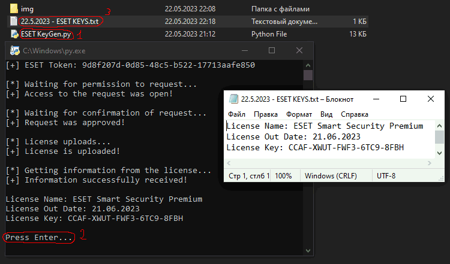

# ESET-KeyGen
ESET-KeyGen - Key generator for ESET Antivirus

# How to use

0. Download [Chrome](https://www.google.com/chrome/) and his [Stable Driver](https://chromedriver.chromium.org/downloads)

NOTE: If your version of chrome is for example 112.0.5615.87 then you need to download a driver
      with the same version (Only the first 3 digits are taken into account, for example 112)

The driver must be unpacked and moved to the folder with main.py. Next, install the Python libraries, in cmd or powershell or other console:

pip install selenium requests

1. Delete your current ESET HOME account

2. Run ESET KeyGen.py and wait until "Press Enter..."
After that you will see in the console the key and the license expiration date.
This information will also be written to a file named "Today date - ESET KEYS.txt".

3. In ESET, click Activate full version of the product with purchased License Key and enter the key from the console in the box that appears.

Just click "Continue" until you are told that you have successfully activated the antivirus.
