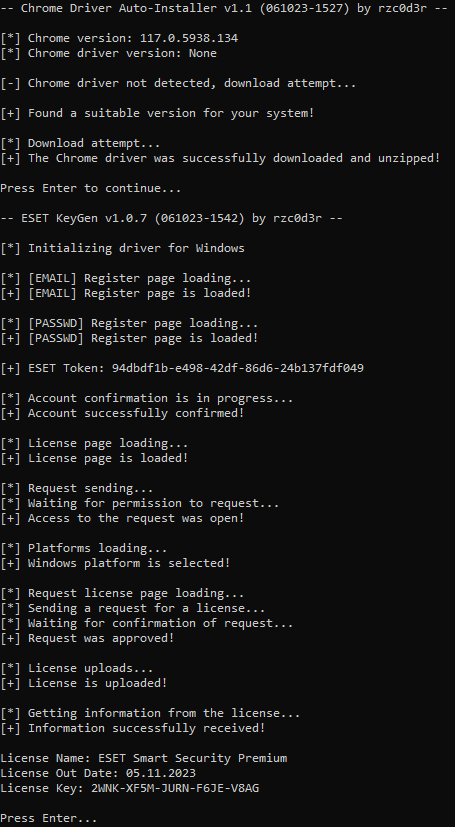
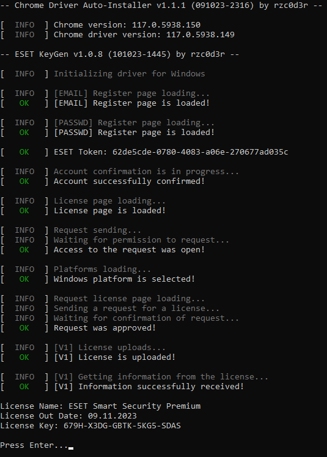

# ESET-KeyGen
ESET-KeyGen - Trial-Key generator for ESET Antivirus (last test was on 18.10.2023 at 00:47)

# How to use

## Installing google chrome and driver
> The project now comes bundled with automatic chrome driver installation!!!
> 
> No more fiddling with it, download only chrome and run!

### Windows
1. Download and install [Chrome](https://www.google.com/chrome/)

### Linux (Using Debian as an example)
1. Download [Chrome](https://www.google.com/chrome/) .deb package and install the downloaded package using the command in terminal:

```
apt install %path to deb%
```

## Installing python and libraries

> This step can be skipped by loading a build from releases (only if the build version matches the version of the code in the branch)

1. Go to the official [Python website](https://www.python.org/downloads) and download the version for your system (the project runs starting with Python 3.8.0)

2. Next, install the Python libraries, in terminal using requirements.txt:

```
pip install -r requirements.txt
```

Or without requirements.txt:

```
pip install -r selenium requests colorama
```

## Preparing ESET

Delete your current ESET HOME account


## Using the repository
1. Run the ESET KeyGen.py file or the assembly executable and wait for "Press Enter..." to appear.
After that you will see in the console the key and the license expiration date.

This information will also be written to a file named "Today date - ESET KEYS.txt"

### Result in Windows:
#### First run without driver


#### Following launches


2. In ESET, click Activate full version of the product with purchased License Key and enter the key from the console in the box that appears


> Just click "Continue" until you are told that you have successfully activated the antivirus.

# Recommendations and information

1. Do not minimize or close the browser window before the program is finished!!!
2. Do not create many license keys in a short period of time, otherwise you will be blocked in ESET HOME for a certain period of time
3. If the program crashes after many attempts and you know that the program is up to date. Try using a VPN
4. If an ACT0 error occurs during activation, check whether the ESET HOME account is connected. If so, disconnect it and try again.
   If the error persists, try activating with [this project](https://github.com/rzc0d3r/ESET-License-Generator).
   If still getting this error reinstall ESET and try again.
