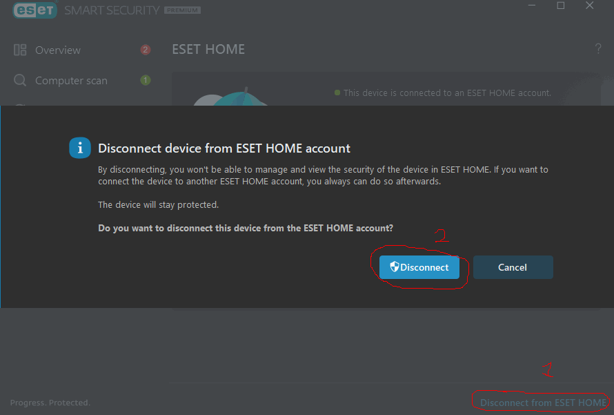
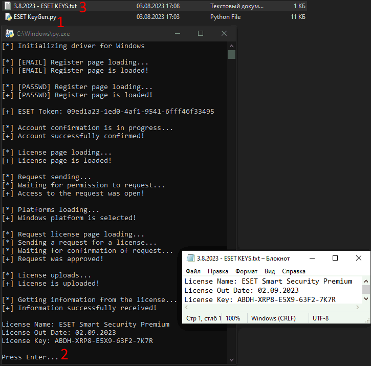
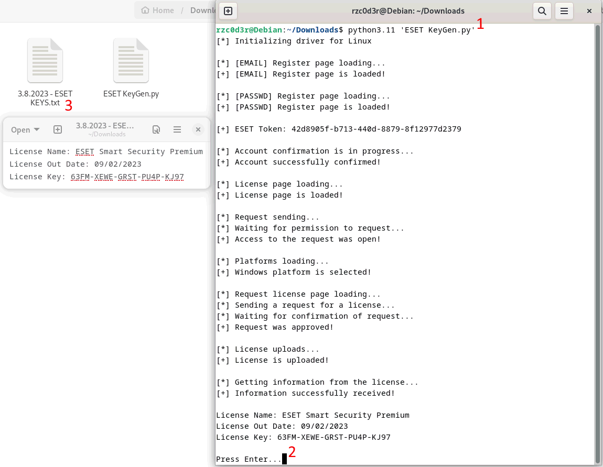

# ESET-KeyGen
ESET-KeyGen - Key generator for ESET Antivirus (successfully tested 02.08.2023 at 21:00)

# How to use

## Installing google chrome and driver
### Windows
1. Download and install [Chrome](https://www.google.com/chrome/)
2. Download stable [ChromeDriver](https://chromedriver.chromium.org/downloads) and extract to folder where is ESET KeyGen.py

> If your version of chrome is for example 115.0.5790.102 then you need to download a driver
      with the same version (Only the first 3 digits are taken into account, for example 115)

> If you can't find the version you need, follow [this link](https://googlechromelabs.github.io/chrome-for-testing/#stable) and find the stable version you need there

### Linux (Using Debian as an example)
1. Download [Chrome](https://www.google.com/chrome/) .deb package and install the downloaded package using the command in terminal:

```
apt install %path to deb%
```

2. Download stable [ChromeDriver](https://chromedriver.chromium.org/downloads) for linux64 platform and extract to /usr/bin

> If your version of chrome is for example 115.0.5790.102 then you need to download a driver
      with the same version (Only the first 3 digits are taken into account, for example 115)

> If you can't find the version you need, follow [this link](https://googlechromelabs.github.io/chrome-for-testing/#stable) and find the stable version you need there

## Installing libraries and preparing ESET

Next, install the Python libraries, in terminal:

```
pip install selenium requests
```

Delete your current ESET HOME account



## Using the repository
1. Run ESET KeyGen.py and wait until "Press Enter..."
After that you will see in the console the key and the license expiration date.

    This information will also be written to a file named "Today date - ESET KEYS.txt"

### In Windows:



### In Linux (Debian12):



3. In ESET, click Activate full version of the product with purchased License Key and enter the key from the console in the box that appears


> Just click "Continue" until you are told that you have successfully activated the antivirus.

# Recommendations and information

1. Do not minimize or close the browser window before the program is finished!!!
2. Do not create many license keys in a short period of time, otherwise you will be blocked in ESET HOME for a certain period of time
3. If the program crashes after many attempts and you know that the program is up to date. Try using a VPN
4. If an ACT0 error occurs during activation, check whether the ESET HOME account is connected. If so, disconnect it and try again. If the error persists, reinstall ESET 
